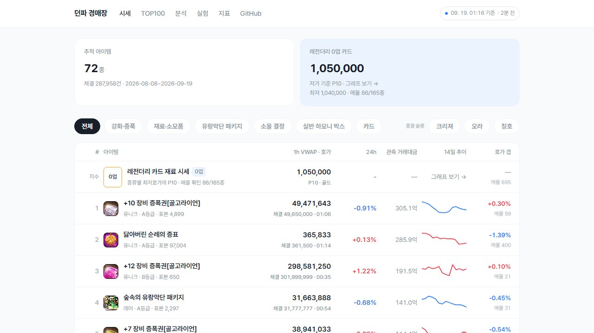
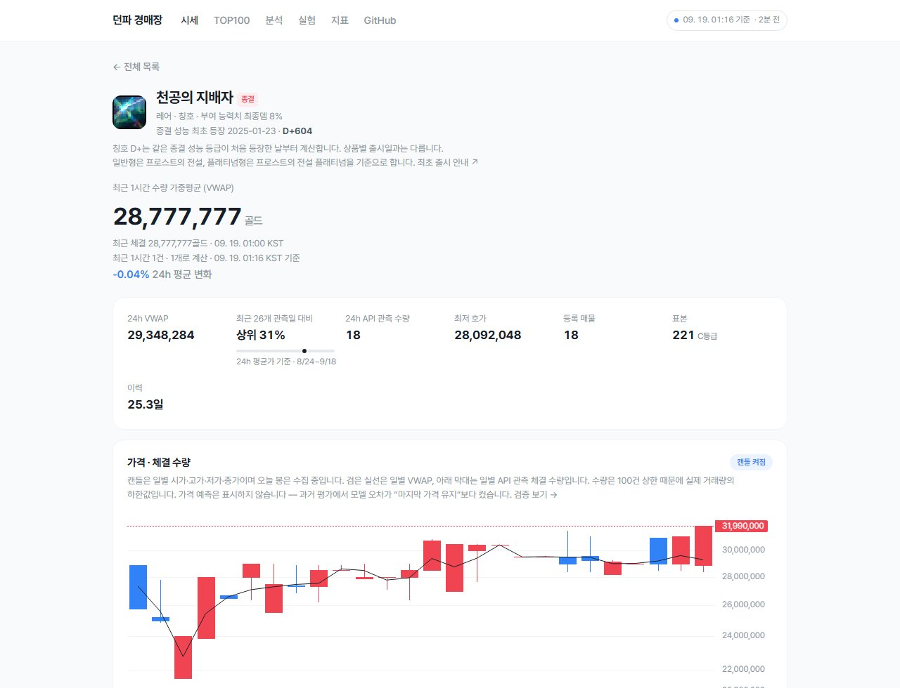
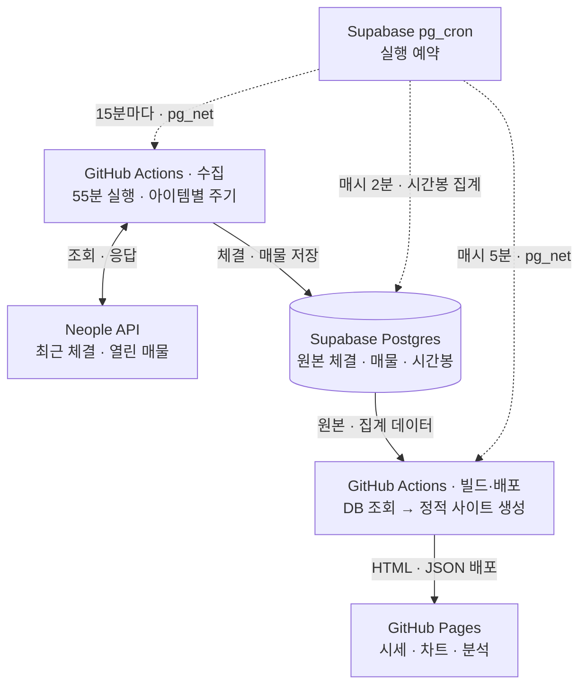

# 던파 경매장 시세 추적기

**https://kimtaehoon1107-gif.github.io/dnf-price-tracker/**

던전앤파이터 경매장의 시세 추이를 수집·시각화하고, 이벤트와 패키지 전후의 가격 변동을 분석합니다.

## 화면





2026-09-09 배포 화면입니다. 가격과 표본 수는 수집·배포 시점에 따라 달라집니다.

## 왜 만드는가

현재 최저 호가와 실제 체결가는 서로 다른 정보입니다. Neople 오픈 API는 **현재 매물(`/df/auction`)과 최근 체결(`/df/auction-sold`)을 모두 제공**합니다.

시세 **추이**를 보려면 이력을 쌓아야 합니다. 체결 API는 최근 100건 또는 최대 1개월 중 먼저 도달하는 한도까지만 제공하므로, **더 긴 가격 시계열은 직접 수집해 보존해야 합니다.** 그래서 이 프로젝트의 본체는 차트가 아니라 수집 파이프라인입니다.

## 지금 상태

**72종을 아이템별 기본 2~60분 주기로 수집**합니다. 100건 포화이면서 그 100건이 현재 폴링 주기의 1.5배도 덮지 못할 때만 최소 1분까지 자동 단축하고, 수집 공백 때문에 생긴 포화는 기록만 남깁니다. GitHub Actions 안에서는 5분 이하 고빈도 종목과 나머지를 분리해 실행합니다.

일반 아이템의 대표 가격은 **데이터 기준 시각 직전 60분의 수량 가중평균(VWAP)** 입니다. `Σ(체결 단가 × 수량) ÷ 총수량`으로 계산하고, 최근 체결가와 거래 시각을 아래에 따로 표시합니다. 1시간 내 관측 체결이 없으면 평균은 비워 둡니다. 카드는 체결 API로 업그레이드를 구분할 수 없어 단계별 최저 호가를 사용합니다. 사이트는 매시간 갱신됩니다.

| 분류 | 종 | 예 |
|---|---|---|
| 카드 | 34 | 딜러·버퍼 부위별 종결 카드 |
| 강화·증폭 | 11 | +3~+12 골고라이언 증폭권, 보호권 |
| 소울 결정 | 6 | 레어~태초 소울 결정 |
| 유랑악단 패키지 | 6 | 패키지와 구성 상자 5종 |
| 실반 하모니 박스 | 4종 신규 | 종이숲 오라·언더웨어 세트·레어 무기 클론 선택 상자·멜로디 카드 |
| 재료·소모품 | 4 | 닳아버린 순례의 증표 등 |
| 칭호·크리쳐·오라 | 7 | 현재 종결 슬롯 아이템 |

실반 하모니 박스 탭에는 기존 칭호 분류의 종이달 오르골 칭호 선택 상자도 함께 표시해 **총 5종**을 비교합니다. 종이달 상자의 기존 이력과 칭호 탭은 유지하며 전체 추적 수에는 중복 집계하지 않습니다. 박스 자체는 별도 거래 아이템이 아닌 NPC 개봉 메뉴입니다. [공식 안내](https://df.nexon.com/pg/forestbandpkg)

종목은 실제로 돈이 도는 것으로 골랐습니다 — 24시간 거래액 상위와, 백필로 30일 이력을 확보할 수 있는 고가 아이템 위주입니다.

칭호의 **종결 성능 D+**는 개별 상품 출시일이 아닌 **같은 종결 성능 등급의 최초 등장일**을 뜻합니다. 일반형(프로스트의 전설·군자의 사계·천공의 지배자)과 플래티넘형(종이달 오르골 선택 상자)은 각각 프로스트의 전설 일반·플래티넘이 나온 **2025-01-23**을 기준으로 합니다. 2026-09-14 API 대조에서 일반형 3종의 최종 데미지 증가 수치는 8%, 프로스트 플래티넘과 종이달 오르골[30Lv]는 모두 9.6%이며 같은 레벨별 스킬 옵션을 확인했습니다. 따라서 종이달 상품의 출시는 새로운 성능 등급의 등장으로 세지 않습니다. [프로스트 킹덤 최초 출시 안내](https://df.nexon.com/community/news/seriashop/541?category=2), [종이달 오르골 구성 안내](https://df.nexon.com/pg/forestbandpkg)

## 데이터로 점검한 것

- **가격 변화에 단기 반전·지속 신호가 있는지 검정합니다.** 종목별 가장 긴 연속 완료 시간봉 구간(최소 30봉)에 VR(2) 검정을 적용합니다. 겹치는 수익률의 편향을 보정하고, 이분산에 견고한 표준오차와 Holm 다중 검정 보정을 적용합니다. 장기 평균회귀와 실제 매수 전략의 유용성은 미검증이며, 체결 수 그룹 비교만으로 관측 잡음을 배제하지 않습니다.
- **예측 성능은 날짜별 롤링 평가로 확인합니다.** 평가 당일을 제외한 자료로 요일 계수와 추세를 다시 추정하고, 마지막 완료 일봉의 VWAP을 유지하는 naive와 1일·7일 뒤 오차를 비교합니다. 백필을 포함한 체결 시각 기준 평가이며 당시 수집기가 보유했던 자료의 재현은 아닙니다. 성능 차이의 원인을 평균회귀라고 단정하지 않습니다.
- **패키지 해체 마진을 관측 체결가로 계산합니다.** 패키지와 구성품 5종의 최근 24시간 VWAP이 모두 있을 때 수수료 3%를 반영합니다. 실제로 실행 가능한 차익을 판단하려면 같은 시점의 매수·매도 가능 가격도 확인해야 합니다.
- **목요일 가격 흐름에는 카드도 포함합니다.** 일반 아이템의 체결가, 카드 0업·맥스업 최저호가를 별도로 표시하며 하나의 평균으로 합치지 않습니다. 카드는 시간별 마지막 호가로 일평균을 만들고, 하루 18시간 이상 관측한 월~일 완료 주가 종목·단계별 4주 이상이면 주평균 100 대비 목요일 차이를 표시합니다. 조건 충족 종목에 같은 비중을 주며 부족한 단계는 표본 진행 상황을 보여 줍니다. 레전더리 P10 지수는 별도 시계열입니다.
- **요일 효과의 통계 검정과 아이템 유형 군집은 보류했습니다.** 목요일 관측 차이와 유의성 판정은 다릅니다. 4주는 카드 패턴의 표시 기준이며 검정력을 보장하지 않고, 패치·이벤트 영향을 제거한 결과도 아닙니다. 메인에서 `p<0.05`·`현재 비유의` 판정은 사용하지 않습니다.

**2026-09-09 11:15 KST 빌드의 검증 예:** 체결가 분석 후보 34종 중 14종이 분산비 검정 조건을 충족했고, Holm 보정 후 유의한 종목은 0종이었습니다. 1일 뒤 예측은 4종·15건 평가에서 모델 MAPE 2.32%, naive 1.97%로 모델의 오차가 더 컸습니다. 이 수치는 해당 시점의 기록이며, 최신 결과는 매시간 재계산됩니다.

자세한 결론은 [분석 페이지](https://kimtaehoon1107-gif.github.io/dnf-price-tracker/analysis.html),
각 숫자를 읽는 방법은 [지표 설명 페이지](https://kimtaehoon1107-gif.github.io/dnf-price-tracker/guide.html)에 있습니다.

## 어떻게 돌아가나



점선은 예약된 작업의 실행, 실선은 API 조회·응답과 데이터 흐름입니다. `pg_net`은 GitHub의 `workflow_dispatch` API를 호출하며, 시간봉 집계는 DB 안에서 실행됩니다.

이 저장소에서는 GitHub Actions의 예약 실행이 40회 넘는 기회 중 거의 생성되지 않았습니다. Supabase의 `pg_cron`이 `pg_net`으로 `workflow_dispatch`를 호출하도록 변경했습니다. 운영 상태는 트리거 호출 결과와 별도로 실제 수집 성공 기록을 기준으로 확인합니다.

감시도 두 단계입니다. 전체 수집기가 살아 있는지와 각 아이템이 자기 폴링 주기 안에 갱신되는지를 따로 봅니다. 전역 가동률만 봤을 때 개별 아이템이 설정 주기의 최대 70배까지 굶었던 일을 반영한 구조입니다.

개별 체결은 최근 분석에 필요한 기간만 보존하고, 장기 가격 이력은 1시간 OHLC·VWAP 봉으로 압축합니다. 예측과 차트는 봉을 사용하므로 개별 체결을 영구 보관하지 않아도 가격 시계열은 계속 늘어납니다.

시세 조회는 DB를 매시간 정적 파일로 구워 GitHub Pages에 올립니다. 대신 임의 아이템을 실시간으로 검색할 수 없고, Neople API가 브라우저 직접 호출에 필요한 CORS 헤더를 제공하지 않아 추적 종목은 수집기에서 관리합니다. 피드백 게시판은 Supabase Edge Function으로 글을 즉시 조회·저장합니다.

## 수집하는 것

**체결** (`/df/auction-sold`) — 실제로 팔린 가격과 수량
**호가** (`/df/auction`) — 현재 올라와 있는 매물, 그리고 그 매물이 **소진되는 과정**

두 번째가 이 프로젝트의 특징입니다. API가 등록 수량과 잔여 수량을 따로 주기 때문에, 같은 매물을 반복 관측하면 체결 API와 별개인 매물 소진 신호를 만들 수 있습니다. 만료 전 소멸에는 취소가 섞일 수 있어 체결량과 합산하지 않습니다.

## 실행

Node 24 이상이 필요하고, 런타임 의존성은 PostgreSQL 클라이언트인 **`pg` 하나**입니다.

```bash
cp .env.example .env     # NEOPLE_API_KEY와 DATABASE_URL 입력
npm ci                   # 의존성 설치
npm run init             # 스키마 + 화이트리스트
npm run collect          # 수집 시작 (켜둔 채로)
npm run stats            # 다른 창에서 현황 확인
```

## 피드백 게시판

`feedback.html`은 회원가입 없는 텍스트 게시판입니다. 닉네임·글 비밀번호로 작성·수정·삭제하고, 관리자 전용 비밀번호로 답변·처리 상태·숨김을 관리합니다. 첨부파일과 일반 댓글은 지원하지 않습니다.

- 설치: `sql/feedback.sql`을 DB에 적용하고 `supabase functions deploy feedback --project-ref <project-ref>`로 함수를 배포합니다. `supabase/config.toml`의 공개 함수 설정을 사용하며, 함수 안에서 권한과 횟수를 검증합니다. 프런트엔드 `web/feedback.js`의 URL은 배포 프로젝트에 맞춥니다.
- 관리자 설정: `npm run feedback:admin` 실행 후 출력되는 **로컬 화면에서 직접** 비밀번호를 입력합니다. 10분 뒤 화면이 만료됩니다. 비밀번호를 잊으면 같은 명령으로 다시 설정합니다. 실제 비밀번호를 소스·명령 인수·이슈에 적지 않습니다.
- 글 비밀번호는 bcrypt(cost 10), 관리자 비밀번호는 bcrypt(cost 12)로 해시해 비공개 스키마에 저장합니다. 클라이언트는 해시나 DB 서비스 키를 받지 않으며, 공개/로그인 역할의 직접 테이블·RPC 접근은 차단합니다.
- 관리자 비밀번호는 현재 페이지 메모리에서만 유지하고 20분 뒤 지웁니다. 매 관리자 요청마다 서버에서 다시 검증합니다. 새로고침하면 로그아웃됩니다.
- 전체 요청 600회/분·20,000회/일, 글 등록 전체 100회/일·IP 해시별 3회/10분, 글 비밀번호 확인 10회/15분/글, 관리자 인증 20회/분으로 제한합니다. 제한은 DB에서 원자적으로 집계하고 실패 시도도 포함합니다. IP는 원문 대신 서버 키로 만든 HMAC으로만 기록하고 만료된 제한 기록은 다음 요청 때 정리합니다. IP 헤더 제한 외에도 전체·글별 제한을 적용합니다. CAPTCHA나 대규모 공격 방어를 보장하는 구성은 아닙니다.
- 테스트: `npm test`, `npm run test:feedback`. `node --env-file=.env scripts/preview-feedback.ts`는 별도 이름의 DB 객체와 테스트 관리자 비밀번호를 쓰며 종료 시 전체 롤백합니다. 테스트 관리자 비밀번호는 운영 계정에 적용되지 않습니다.

게시판 테이블은 시세 테이블의 보존·삭제 작업과 분리되어 있습니다. DB 백업 시 게시글과 비공개 비밀번호 해시도 포함되므로 백업을 공개하지 않습니다.

## 한계

정직하게 밝혀둡니다.

- **API 관측 거래량은 하한값입니다.** 체결 API가 한 번에 100건까지만 주므로 폴링 사이에 그보다 많이 거래되면 초과분을 알 수 없습니다. 매물 소진 관측에는 판매와 취소가 섞일 수 있고 API 체결과도 중복될 수 있어, 서로 합산하지 않습니다.
- **체결가 분석에는 실제 거래된 가격만 들어갑니다.** 열린 매물도 별도로 수집하지만 호가와 체결가는 구분합니다. 체결 평균이 전체 매물의 가치나 균형가를 대표한다고 보장할 수 없습니다.
- **가격은 구매 지불가 기준**입니다. 경매장 판매 수수료 때문에 판매자 실수령액은 더 낮습니다.
- 수집 시작일 이전의 데이터는 존재하지 않습니다. 백필로 최대 1개월을 확보하지만 아이템마다 다릅니다.

## 데이터 출처

본 프로젝트는 **네오플 오픈 API 서비스**를 이용합니다. (https://developers.neople.co.kr)

비상업적 개인 프로젝트이며 API 이용에 대한 어떠한 대가도 받지 않습니다.

네오플 또는 넥슨이 운영하거나 보증하는 공식 서비스가 아닌 개인 프로젝트입니다.
표시되는 가격과 분석 결과는 수집 시점과 표본 범위에 따라 실제 경매장과 다를 수 있습니다.
분석과 예측은 과거 관측 데이터를 기반으로 한 실험 결과이며, 향후 가격이나 실제 거래 가능성을 보장하지 않습니다.

## 라이선스와 게임 데이터

[MIT License](LICENSE)는 이 저장소에서 직접 작성한 소스 코드에만 적용됩니다.
던전앤파이터 명칭, 아이템 정보, 이미지 및 API 결과 데이터의 권리는 네오플 또는 각 권리자에게 있으며,
API 데이터 이용에는 [네오플 오픈 API 이용약관](https://developers.neople.co.kr/contents/policy)이 적용됩니다.
MIT License가 게임 데이터에 대한 별도의 이용 권한을 부여하지는 않습니다.
