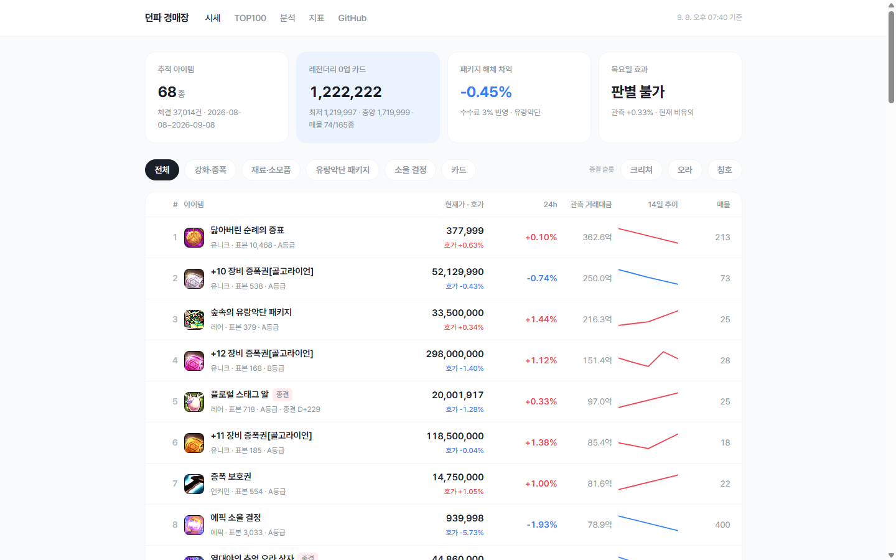
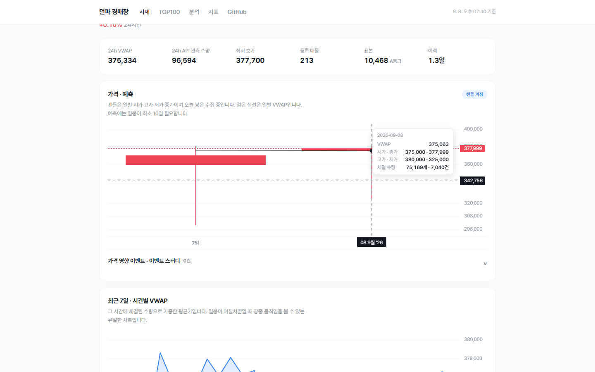

# 던파 경매장 시세 추적기

**https://kimtaehoon1107-gif.github.io/dnf-price-tracker/**

던전앤파이터 경매장의 시세 추이를 수집·시각화하고, 이벤트와 패키지 전후의 가격 변동을 분석합니다.

## 화면





## 왜 만드는가

던파 경매장 시세 사이트는 이미 여럿 있지만, 대부분 **"지금 최저가가 얼마"**를 보여줍니다. Neople 오픈 API가 현재 매물만 주기 때문입니다.

시세 **추이**는 사정이 다릅니다. API는 최근 체결 100건 또는 최대 1개월치만 돌려주므로, **과거 히스토리는 직접 수집해 쌓지 않으면 존재하지 않습니다.** 그래서 이 프로젝트의 본체는 차트가 아니라 수집 파이프라인입니다.

## 지금 상태

**68종을 아이템별 기본 2~60분 주기로 수집**합니다. 100건 포화이면서 그 100건이 현재 폴링 주기의 1.5배도 덮지 못할 때만 최소 1분까지 자동 단축하고, 수집 공백 때문에 생긴 포화는 기록만 남깁니다. GitHub Actions 안에서는 5분 이하 고빈도 종목과 나머지를 분리해 실행합니다.

| 분류 | 종 | 예 |
|---|---|---|
| 카드 | 34 | 딜러·버퍼 부위별 종결 카드 |
| 강화·증폭 | 11 | +3~+12 골고라이언 증폭권, 보호권 |
| 소울 결정 | 6 | 레어~태초 소울 결정 |
| 유랑악단 패키지 | 6 | 패키지와 구성 상자 5종 |
| 재료·소모품 | 4 | 닳아버린 순례의 증표 등 |
| 칭호·크리쳐·오라 | 7 | 현재 종결 슬롯 아이템 |

종목은 실제로 돈이 도는 것으로 골랐습니다 — 24시간 거래액 상위와, 백필로 30일 이력을 확보할 수 있는 고가 아이템 위주입니다.

## 데이터로 답한 것

- **가격은 랜덤워크가 아니라 평균회귀합니다.** 분산비 검정(VR(2)) 중앙값이 **0.67**이고 34종 중 19종이 유의하게 1보다 작습니다. 봉당 체결 수로 3등분해 비교해도 VR이 1로 돌아가지 않아, 얇은 표본이 만든 착시가 아닙니다.
- **그래서 추세 외삽 모델은 naive에 집니다.** 시장이 되돌아오는데 직선으로 이어 그렸으니 당연한 결과입니다. "예측이 안 된다"가 아니라 "이 모델이 시장 성질과 안 맞는다"가 정확한 진단입니다.
- **패키지 해체 차익은 재정거래로 이미 지워져 있습니다.** 수수료 3%를 반영하면 사실상 0입니다.
- **아직 못 낸 답은 절을 올리지 않았습니다.** 요일 효과는 조건을 충족한 종목이 4종뿐이라 최소 탐지 가능 효과가 ±4.0%로, 사실상 아무것도 판별할 수 없습니다. 아이템 유형 군집도 34종으로는 안정적이지 않습니다. **표본이 얇은 채로 결론을 내는 대신 왜 못 내는지를 한계 절에 적었습니다.**

자세한 결론은 [분석 페이지](https://kimtaehoon1107-gif.github.io/dnf-price-tracker/analysis.html),
각 숫자를 읽는 방법은 [지표 설명 페이지](https://kimtaehoon1107-gif.github.io/dnf-price-tracker/guide.html)에 있습니다.

## 어떻게 돌아가나

```text
Supabase pg_cron ──pg_net──> GitHub Actions ──> Neople API
                                              │
                                              ▼
                                      Supabase Postgres
                                      원본 체결 → 시간봉
                                              │ 매시간 빌드
                                              ▼
                                         GitHub Pages
```

이 저장소에서는 GitHub Actions의 예약 실행이 40회 넘는 기회 중 거의 생성되지 않았습니다. 수집 코드는 유지하고, Supabase의 `pg_cron`이 `pg_net`으로 `workflow_dispatch`를 호출하도록 시계만 바꿨습니다. 이후 수집 트리거 성공률은 10% 수준에서 100%로 올라갔습니다.

감시도 두 단계입니다. 전체 수집기가 살아 있는지와 각 아이템이 자기 폴링 주기 안에 갱신되는지를 따로 봅니다. 전역 가동률만 봤을 때 개별 아이템이 설정 주기의 최대 70배까지 굶었던 일을 반영한 구조입니다.

개별 체결은 최근 분석에 필요한 기간만 보존하고, 장기 가격 이력은 1시간 OHLC·VWAP 봉으로 압축합니다. 예측과 차트는 봉을 사용하므로 개별 체결을 영구 보관하지 않아도 가격 시계열은 계속 늘어납니다.

조회 서버는 없습니다. DB를 매시간 정적 파일로 구워 GitHub Pages에 올리므로 운영 서버 비용이 들지 않습니다. 대신 임의 아이템을 실시간으로 검색할 수 없고, Neople API가 브라우저 직접 호출에 필요한 CORS 헤더를 제공하지 않아 추적 종목은 수집기에서 관리합니다.

## 수집하는 것

**체결** (`/df/auction-sold`) — 실제로 팔린 가격과 수량
**호가** (`/df/auction`) — 현재 올라와 있는 매물, 그리고 그 매물이 **소진되는 과정**

두 번째가 이 프로젝트의 특징입니다. API가 등록 수량과 잔여 수량을 따로 주기 때문에, 같은 매물을 반복 관측하면 체결 API와 별개인 매물 소진 신호를 만들 수 있습니다. 만료 전 소멸에는 취소가 섞일 수 있어 체결량과 합산하지 않습니다.

## 실행

Node 24 이상이 필요하고, 런타임 의존성은 PostgreSQL 클라이언트인 **`pg` 하나**입니다.

```bash
cp .env.example .env     # NEOPLE_API_KEY와 DATABASE_URL 입력
npm run init             # 스키마 + 화이트리스트
npm run collect          # 수집 시작 (켜둔 채로)
npm run stats            # 다른 창에서 현황 확인
```

## 한계

정직하게 밝혀둡니다.

- **API 관측 거래량은 하한값입니다.** 체결 API가 한 번에 100건까지만 주므로 폴링 사이에 그보다 많이 거래되면 초과분을 알 수 없습니다. 매물 소진 관측에는 판매와 취소가 섞일 수 있고 API 체결과도 중복될 수 있어, 서로 합산하지 않습니다.
- **팔린 것만 봅니다.** 비싸서 안 팔린 매물은 데이터에 없어, 실제 균형가보다 낮게 추정될 수 있습니다(생존 편향).
- **가격은 구매 지불가 기준**입니다. 경매장 판매 수수료 때문에 판매자 실수령액은 더 낮습니다.
- 수집 시작일 이전의 데이터는 존재하지 않습니다. 백필로 최대 1개월을 확보하지만 아이템마다 다릅니다.

## 데이터 출처

본 프로젝트는 **네오플 오픈 API 서비스**를 이용합니다. (https://developers.neople.co.kr)

비상업적 개인 프로젝트이며 API 이용에 대한 어떠한 대가도 받지 않습니다.
