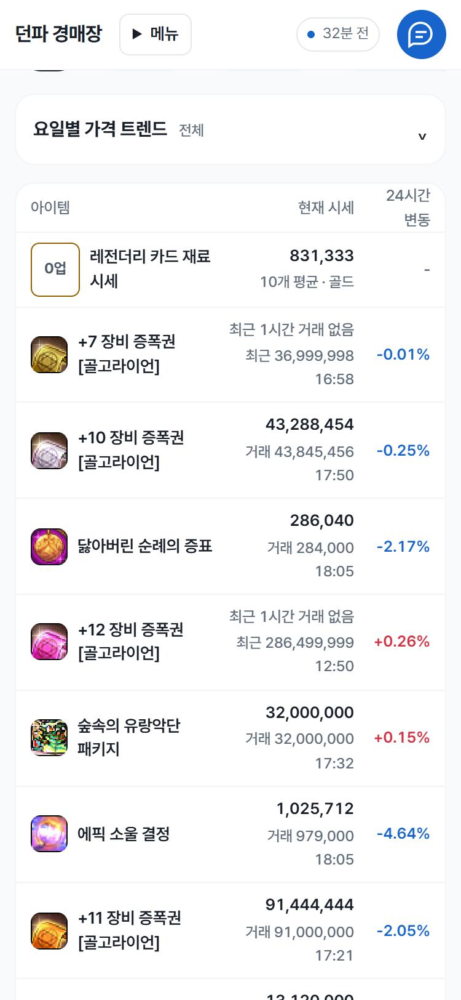
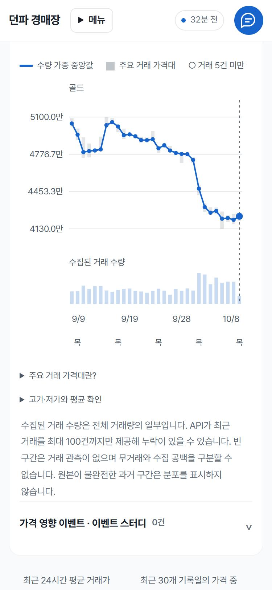
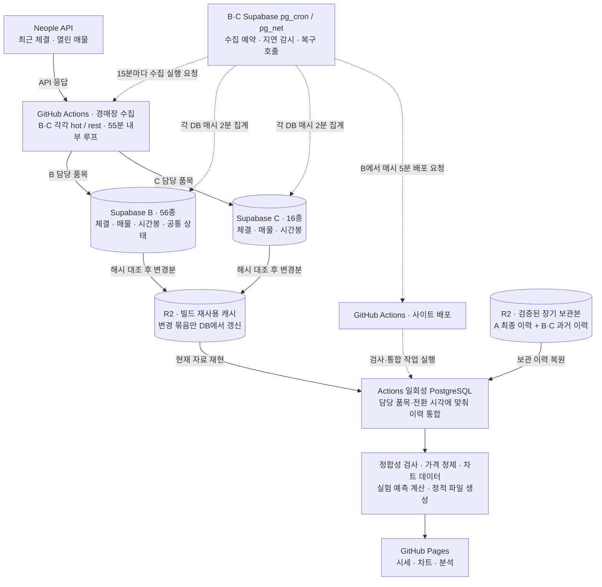
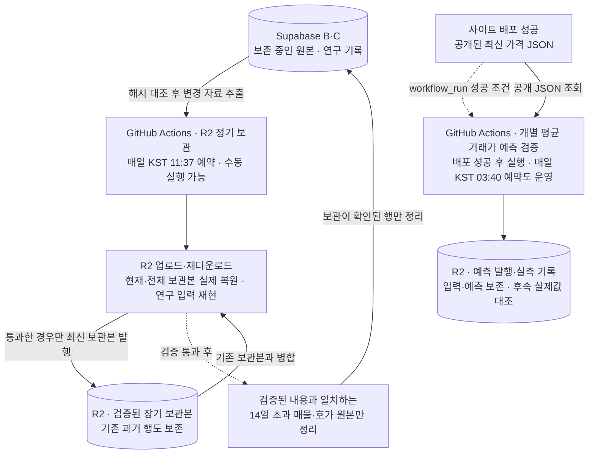

# 던파 경매장 시세 추적기

**https://kimtaehoon1107-gif.github.io/dnf-price-tracker/**

던전앤파이터 경매장의 시세를 수집·보존·시각화하고, 이벤트와 패키지 전후의 가격 변동을 분석하는 개인 프로젝트입니다. Neople 오픈 API는 과거 시세를 주지 않으므로 **이 프로젝트의 본체는 차트가 아니라 수집 파이프라인**입니다.

## 이 프로젝트가 보여주는 것

- **수집 파이프라인** — 72종을 아이템별 2~60분 주기로 수집합니다. 수집은 Supabase B·C 두 곳으로 나누고, GitHub Actions와 pg_cron이 실행·감시·자가복구를 맡습니다.
- **서버 0대** — 매시간 정적 사이트를 구워 GitHub Pages로 제공하므로 방문자의 조회가 DB 읽기를 늘리지 않습니다.
- **검증된 장기 보관** — R2 보관본을 실제로 복원해 연구 입력을 재현할 수 있어야만 오래된 원본을 정리합니다.
- **결과를 부풀리지 않는 분석** — 가능한 곳에서는 예측을 발행한 당시 값을 저장해 나중의 실제 가격과 비교하고, 이미 알려진 과거를 되돌려 본 결과와 구분합니다. 모델이 단순 기준선(마지막 가격 유지)보다 나빴던 결과도 그대로 공개하고, 한계는 결과 옆에 적습니다.
- **테스트** — `npm test`(테스트 모듈 30개)가 사이트 배포 전에 실행됩니다.

## 화면

<table>
<tr>
<td width="50%"></td>
<td width="50%"></td>
</tr>
</table>

2026-10-08 배포 화면(모바일)입니다. 가격과 표본 수는 수집·배포 시점에 따라 달라집니다.

## 왜 만드는가

현재 최저 호가와 실제 체결가는 서로 다른 정보입니다. Neople 오픈 API는 **현재 매물(`/df/auction`)과 최근 체결(`/df/auction-sold`)을 모두 제공**합니다.

시세 **추이**를 보려면 이력을 쌓아야 합니다. 체결 API는 최근 100건 또는 최대 1개월 중 먼저 도달하는 한도까지만 제공하므로, **더 긴 가격 시계열은 직접 수집해 보존해야 합니다.** 그래서 이 프로젝트의 본체는 차트가 아니라 수집 파이프라인입니다.

## 지금 상태

**72종을 아이템별 기본 2~60분 주기로 수집**합니다. 100건 포화이면서 그 100건이 현재 폴링 주기의 1.5배도 덮지 못할 때만 최소 1분까지 자동 단축하고, 수집 공백 때문에 생긴 포화는 기록만 남깁니다. GitHub Actions 안에서는 5분 이하 고빈도 종목과 나머지를 분리해 실행합니다.

일반 아이템의 대표 가격은 **데이터 기준 시각 직전 60분의 수량 가중평균(VWAP)** 입니다. 1시간 내 관측 체결이 없으면 평균은 비워 두고, 최근 체결가와 시각을 따로 보여줍니다. 카드는 체결 API로 업그레이드를 구분할 수 없어 단계별 최저 호가를 사용합니다. 사이트는 매시간 갱신됩니다.

카드 34 · 강화·증폭 11 · 소울 결정 6 · 유랑악단 패키지 6 · 실반 하모니 박스 4 · 재료·소모품 4 · 칭호·크리쳐·오라 7 = **72종**. 분류별 예와 표시 규칙은 [추적 품목](docs/tracked-items.md)에 있습니다.

## 어떻게 돌아가나

2026-10-08 기준입니다. 현재 수집은 **B 56종 · C 16종**으로 나누고, 일시중지한 A의 과거 자료는 검증된 R2 보관본에서 읽습니다. 운영 DB에 과거 전체를 다시 넣지 않고, GitHub Actions의 일회성 PostgreSQL에서 이력을 합칩니다.

### 수집 → 이력 통합 → 사이트 배포


```mermaid
flowchart TD
    api["Neople API<br/>최근 체결 · 열린 매물"]
    cron["B·C Supabase pg_cron / pg_net<br/>수집 예약 · 지연 감시 · 복구 호출"]
    collect["GitHub Actions · 경매장 수집<br/>B·C 각각 hot / rest · 55분 내부 루프"]
    b[("Supabase B · 56종<br/>체결 · 매물 · 시간봉 · 공통 상태")]
    c[("Supabase C · 16종<br/>체결 · 매물 · 시간봉")]
    build["GitHub Actions · 사이트 배포"]
    cache[("R2 · 빌드 재사용 캐시<br/>변경 묶음만 DB에서 갱신")]
    history[("R2 · 검증된 장기 보관본<br/>A 최종 이력 + B·C 과거 이력")]
    replica["Actions 일회성 PostgreSQL<br/>담당 품목·전환 시각에 맞춰 이력 통합"]
    render["정합성 검사 · 가격 정제 · 차트 데이터<br/>실험 예측 계산 · 정적 파일 생성"]
    pages["GitHub Pages<br/>시세 · 차트 · 분석"]

    cron -. "15분마다 수집 실행 요청" .-> collect
    api -->|"API 응답"| collect
    collect -->|"B 담당 품목"| b
    collect -->|"C 담당 품목"| c
    cron -. "각 DB 매시 2분 집계" .-> b
    cron -. "각 DB 매시 2분 집계" .-> c
    cron -. "B에서 매시 5분 배포 요청" .-> build
    build -. "검사·통합 작업 실행" .-> replica
    b -->|"해시 대조 후 변경분"| cache
    c -->|"해시 대조 후 변경분"| cache
    cache -->|"현재 자료 재현"| replica
    history -->|"보관 이력 복원"| replica
    replica --> render --> pages
```

실선은 데이터 흐름, 점선은 작업 실행·예약입니다. DB에서 캐시를 갱신하고 일회성 DB를 구성하는 과정은 사이트 배포 작업 안에서 실행됩니다. 사이트 관련 코드가 main에 반영될 때와 수동 요청으로도 배포합니다.

시간봉 집계는 각 운영 DB 안에서 실행하며, 수집·집계 지연과 원본 대조 불일치를 검사합니다. 수집 감시견은 전체 수집 공백과 품목별 지연을 나눠 확인하고 복구 실행·GitHub Issue 알림을 요청합니다. 단, 감시견도 같은 Supabase의 pg_cron 위에 있어 해당 기반 서비스의 장애까지 독립적으로 감시하지는 못합니다.

### 정기 보관과 배포 후 예측 검증


```mermaid
flowchart TD
    db[("Supabase B·C<br/>보존 중인 원본 · 연구 기록")]
    archive["GitHub Actions · R2 정기 보관<br/>매일 KST 11:37 예약 · 수동 실행 가능"]
    verify["R2 업로드·재다운로드<br/>현재·전체 보관본 실제 복원 · 연구 입력 재현"]
    history[("R2 · 검증된 장기 보관본<br/>기존 과거 행도 보존")]
    prune["검증된 내용과 일치하는<br/>14일 초과 매물·호가 원본만 정리"]
    pages["사이트 배포 성공<br/>공개된 최신 가격 JSON"]
    forecast["GitHub Actions · 개별 평균 거래가 예측 검증<br/>배포 성공 후 실행 · 매일 KST 03:40 예약도 운영"]
    journal[("R2 · 예측 발행·실측 기록<br/>입력·예측 보존 · 후속 실제값 대조")]

    db -->|"해시 대조 후 변경 자료 추출"| archive
    archive --> verify
    history -->|"기존 보관본과 병합"| verify
    verify -->|"통과한 경우만 최신 보관본 발행"| history
    verify -. "검증 통과 후" .-> prune
    prune -->|"보관이 확인된 행만 정리"| db
    pages -. "workflow_run 성공 조건" .-> forecast
    pages -->|"공개 JSON 조회"| forecast
    forecast --> journal
```

보관 검증에 실패하면 최신 보관본을 바꾸거나 원본 정리를 진행하지 않습니다. B·C의 보관 경로는 분리하며, 오래된 매물·호가 원본을 운영 DB에서 정리해도 검증된 R2 이력은 유지합니다. 보관본과 빌드 캐시는 용도가 다르고, 예측 발행 기록도 별도로 관리합니다.

배포 후 예측 검증은 공개 JSON을 사용하므로 운영 DB 원본을 다시 추출하지 않습니다. 화면용 실험 예측 계산과 별도 작업이며, 검증 실행의 성공은 예측 정확도가 입증됐다는 뜻이 아닙니다. 기존 고정 구성 지수의 예측·실측 기록은 사이트 빌드 과정에서 B에 저장하는 별도 연구 흐름으로 유지합니다.

| 실행 작업 | 설정·구현 |
|---|---|
| B·C 경매장 수집 및 예약·감시 | [collect.yml](.github/workflows/collect.yml) · [scheduler.sql](sql/scheduler.sql) · [watchdog.sql](sql/watchdog.sql) |
| R2 + B·C 통합 사이트 빌드·배포 | [pages.yml](.github/workflows/pages.yml) · [build-history-site.ts](scripts/build-history-site.ts) · [이력 담당 경계](config/history-sources.json) |
| 정기 보관·실제 복원 검증·원본 정리 | [archive-research.yml](.github/workflows/archive-research.yml) · [보관 정책](docs/archive-retention.md) |
| 개별 평균 거래가 예측 발행·평가 | [daily-vwap-forecast.yml](.github/workflows/daily-vwap-forecast.yml) · [record-daily-vwap.ts](scripts/record-daily-vwap.ts) |

[GitHub Actions 실행 기록](https://github.com/kimtaehoon1107-gif/dnf-price-tracker/actions)에서 각 작업의 단계와 결과를 확인할 수 있습니다. 예약 시각은 실행 보장 시각이 아니며, 실제 수집 성공 기록과 공개 데이터 기준 시각을 따로 확인합니다.

시세 조회는 정적 파일을 제공하므로 방문자의 조회가 운영 DB 읽기를 직접 늘리지 않습니다. 추적 품목은 수집기에서 관리하고, 피드백 게시판은 별도의 Supabase B Edge Function으로 즉시 조회·저장합니다.

## 수집하는 것

**체결** (`/df/auction-sold`) — 실제로 팔린 가격과 수량
**호가** (`/df/auction`) — 현재 올라와 있는 매물, 그리고 그 매물이 **소진되는 과정**

두 번째가 이 프로젝트의 특징입니다. API가 등록 수량과 잔여 수량을 따로 주기 때문에, 같은 매물을 반복 관측하면 체결 API와 별개인 매물 소진 신호를 만들 수 있습니다. 만료 전 소멸에는 취소가 섞일 수 있어 체결량과 합산하지 않습니다. 판매와 취소를 구분할 수 없으므로 소진 속도는 화면에 표시하지 않고 원자료만 보존하며, 화면에는 시간별 가격과 매물 잔량을 같은 시간축에 보여 줍니다.

## 실행

Node 24 이상이 필요하고, 런타임 의존성은 PostgreSQL 클라이언트인 **`pg` 하나**입니다.

```bash
cp .env.example .env     # NEOPLE_API_KEY와 DATABASE_URL 입력
npm ci                   # 의존성 설치
npm run init             # 스키마 + 화이트리스트
npm run collect          # 수집 시작 (켜둔 채로)
npm run stats            # 다른 창에서 현황 확인
npm test                # 테스트(DB·API 키 없이 실행)
```

## 더 읽기

- [분석 페이지](https://kimtaehoon1107-gif.github.io/dnf-price-tracker/analysis.html) — 가격이 랜덤워크인지, 예측할 수 있는지에 대한 결론과 한계
- [지표 설명 페이지](https://kimtaehoon1107-gif.github.io/dnf-price-tracker/guide.html) — 화면의 각 숫자를 읽는 방법
- [분석·예측 기록](docs/analysis-notes.md) — 표시 가격 정제, 검정·예측 평가 수치, 사전 예측 방식
- [추적 품목](docs/tracked-items.md) · [피드백 게시판](docs/feedback-board.md)
- [문서 목록](docs/README.md) — 연구 프로토콜·결과·증거 파일 색인

## 한계

유랑악단 패키지의 [삭제 전 분석 규칙](docs/package-end-preregistration.md)과
[21종 초기 자료 점검](docs/package-study-audit-20260928.md)을 공개합니다.
공식 공지상 패키지·구성 상자는 2026-11-05 06:00 KST 삭제되므로 삭제 후 가격 상승을 분석하지 않습니다.
매시간 통합 빌드 뒤 [연구 점검 보고서](https://kimtaehoon1107-gif.github.io/dnf-price-tracker/package-study.html)를 갱신합니다.

정직하게 밝혀둡니다.

- **API 관측 거래량은 하한값입니다.** 체결 API가 한 번에 100건까지만 주므로 폴링 사이에 그보다 많이 거래되면 초과분을 알 수 없습니다. 매물 소진 관측에는 판매와 취소가 섞일 수 있고 API 체결과도 중복될 수 있어, 서로 합산하지 않습니다.
- **체결가 분석에는 실제 거래된 가격만 들어갑니다.** 열린 매물도 별도로 수집하지만 호가와 체결가는 구분합니다. 체결 평균이 전체 매물의 가치나 균형가를 대표한다고 보장할 수 없습니다.
- **가격은 구매 지불가 기준**입니다. 경매장 판매 수수료 때문에 판매자 실수령액은 더 낮습니다.
- 수집 시작일 이전의 데이터는 존재하지 않습니다. 백필로 최대 1개월을 확보하지만 아이템마다 다릅니다.

## 데이터 출처

본 프로젝트는 **네오플 오픈 API 서비스**를 이용합니다. (https://developers.neople.co.kr)

비상업적 개인 프로젝트이며 API 이용에 대한 어떠한 대가도 받지 않습니다.

네오플 또는 넥슨이 운영하거나 보증하는 공식 서비스가 아닌 개인 프로젝트입니다.
표시되는 가격과 분석 결과는 수집 시점과 표본 범위에 따라 실제 경매장과 다를 수 있습니다.
분석과 예측은 과거 관측 데이터를 기반으로 한 실험 결과이며, 향후 가격이나 실제 거래 가능성을 보장하지 않습니다.

## 라이선스와 게임 데이터

[MIT License](LICENSE)는 이 저장소에서 직접 작성한 소스 코드에만 적용됩니다.
던전앤파이터 명칭, 아이템 정보, 이미지 및 API 결과 데이터의 권리는 네오플 또는 각 권리자에게 있으며,
API 데이터 이용에는 [네오플 오픈 API 이용약관](https://developers.neople.co.kr/contents/policy)이 적용됩니다.
MIT License가 게임 데이터에 대한 별도의 이용 권한을 부여하지는 않습니다.
