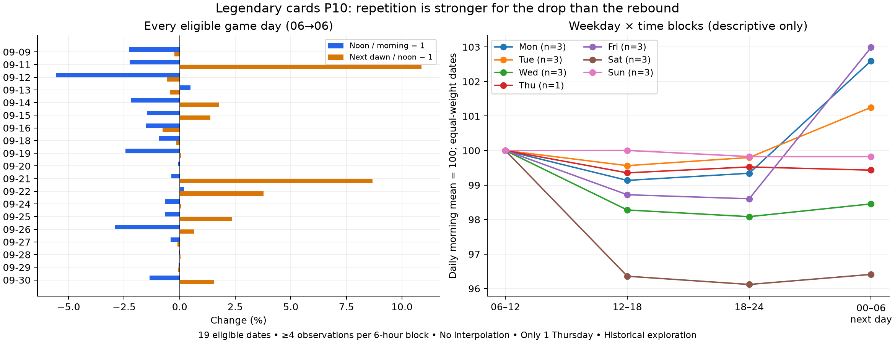

# 카드 P10: 날짜별 반복성과 요일×시간대

**낮에 가격이 낮아지는 방향은 자주 관측됐다. 그러나 큰 폭의 하락 후 회복이 매일 반복되지는 않았다.** 요일별로 나누면 대부분 3일, 목요일은 1일이라 요일 고유의 효과를 확정할 수 없다.

## 범위와 방법

2026-10-02 분석, 입력은 앞선 예측 연구와 동일한 **2026-10-01 18:00 KST** 기준 검증 보관본이다. 신규 10월 2일 관측을 반영한 결과는 아니다. 입력 해시는 결과 JSON에 보존했다.

하루를 KST 06~다음 날 06시로 묶고 A=06~12, B=12~18, C=18~24, D=다음 날 00~06의 네 구간을 사용했다. 구간당 6개 시간 중 4개 이상 관측된 날만 포함하고 결측을 보간하지 않는다. 각 구간은 관측 시간 가격의 산술평균이다. `prepare()`의 앞선 연구와 동일한 입력을 사용하며 일반 품목은 체결 가격·매물이 함께 관측된 시간에 조건부다.

- 낮 변화 = B/A − 1, 회복 = D/B − 1. 둘 다 충족해야 하락 후 회복으로 센다.
- 회복은 **낮보다 높다**는 뜻이다. 오전 가격까지 회복했다거나 연속적으로 상승했다는 뜻이 아니다.
- 임계값 0%, 0.5%, 1%를 모두 보고한다. 각각 임계값을 엄격히 초과하는 하락·상승이다.
- 기존 평균 곡선을 본 뒤 정한 구간이므로 **후향적 탐색**이다. 이 계산은 새로운 예측 모델이나 통계적 유의성 검정이 아니다.

## 카드 P10 결과

| 기준 | 전체 관측 19일 | 이전 예측 평가 10일 |
|---|---:|---:|
| 낮이 오전보다 낮음 | 17/19 (89.5%) | 9/10 |
| 새벽이 낮보다 높음 | 12/19 (63.2%) | 8/10 |
| 같은 날 하락 후 회복 | 11/19 (57.9%) | 7/10 |
| 양쪽 변화가 각각 0.5% 초과 | 6/19 (31.6%) | 3/10 |
| 양쪽 변화가 각각 1% 초과 | 4/19 (21.1%) | 1/10 |

전체 19일은 09-09~09-30 중 조건을 만족한 날이다. 낮 변화 중앙값은 **−0.94%**, 회복 중앙값은 **+0.06%**다. 일부 큰 회복일이 평균을 끌어올린다. 예를 들어 09-11 회복은 +10.88%, 09-21은 +8.67%인 반면, 회복으로 센 09-20의 상승은 약 +0.000017%다. 따라서 방향만 센 수치와 변화 폭을 함께 봐야 한다.

24시간이 모두 관측된 9일만 사용하면 하락 9/9, 하락 후 회복 7/9지만 양쪽 0.5% 초과는 2/9, 1% 초과는 0/9다. 모든 사용 시간에 성공한 수집/조사 기록이 확인된 10일에서는 각각 9/10, 7/10, 3/10, 1/10이다. 표본을 엄격히 해도 큰 폭의 반복이 매일 나타난다는 결론은 나오지 않는다.



## 요일과 시간대를 함께 보면

요일은 06시에 시작한 게임 하루의 요일이다. 예를 들어 월요일 행의 새벽은 달력상 화요일 00~06시다.

| 시작 요일 | 날짜 수 | 낮 하락 | 하락 후 회복 | 양쪽 0.5% 초과 | 낮 변화 중앙값 | 회복 중앙값 |
|---|---:|---:|---:|---:|---:|---:|
| 월 | 3 | 3 | 3 | 1 | −0.38% | +1.76% |
| 화 | 3 | 2 | 1 | 1 | −0.05% | +1.39% |
| 수 | 3 | 3 | 1 | 1 | −1.53% | −0.24% |
| 목 | 1 | 1 | 1 | 0 | −0.65% | +0.08% |
| 금 | 3 | 3 | 2 | 2 | −0.94% | +2.35% |
| 토 | 3 | 3 | 2 | 1 | −2.91% | +0.06% |
| 일 | 3 | 2 | 1 | 0 | −0.07% | −0.10% |

이 표는 요일×시간대의 **관측 비교**이며 요일 효과를 분리해 추정한 회귀나 검정은 아니다. 주별 시장 변화·이벤트·결측의 영향을 분리하지 않았다. 금요일 회복·토요일 하락은 후속 확인 후보일 뿐, 3일로 일반화하거나 유리한 거래 요일로 지정하지 않는다.

목요일 09-10·09-17은 오전 구간 관측이 각각 2시간·1시간뿐이라 제외됐다. 남은 목요일은 09-24 한 날이다. 결측은 점검 시간과 관련될 수 있으나 이 분석만으로 원인을 확인하지는 않았다. 09-23도 오전 2시간으로 제외되었다. 10-01은 입력 기준 아직 06→06 하루가 끝나지 않아 제외했다. 따라서 관측 가능한 날만 남기는 편향이 있다.

## 소울 결정 보조 비교

같은 기준을 레전더리 소울 결정에도 적용했다. 카드와 같은 하락→회복 형태는 전체 20일 중 2일, 이전 평가 10일 중 0일이었다. 전체 평균 구간 지수는 오전 100, 낮 104.26, 저녁 107.88, 새벽 104.48이었다. 소울 결정은 카드와 다른 방향이며 카드의 패턴을 그대로 적용할 수 없다. 이번 계산은 소울 결정의 상승→하락 반복성을 별도로 검정한 것은 아니다.

## 해석과 재현

**카드의 낮 하락 방향은 반복됐지만 하락 폭과 회복 폭까지 안정적이었다고는 말할 수 없다.** 작은 변화가 많으면 현재 가격을 유지하는 예측이, 과한 하락·회복을 그리는 모델보다 가격 오차가 작을 수 있다. 이번 집계는 앞선 예측 모델의 실패 원인을 확정하거나 매매 수익을 검증하지 않는다.

다음에는 이 비교 구간을 고정하고 신규 기간에서도 같은 반복률·변화 폭이 유지되는지 확인해야 한다. 요일별로는 여러 주를 더 확보하고 점검일 결측을 별도로 다뤄야 한다.

```sh
node scripts/check-daily-repetition.ts
python scripts/plot-daily-repetition.py
```

[전체 날짜·제외 사유·요일·민감도 결과 JSON](evidence/daily-repetition-20261002.json). 별도의 Python 계산으로 날짜 요일 매핑, 날짜별 변화율, 반복 횟수, 중앙값을 대조했다. 그래프는 동일 결과로 생성했다. 운영 수집·웹 화면·예측 발행 일정은 변경하지 않았다.
