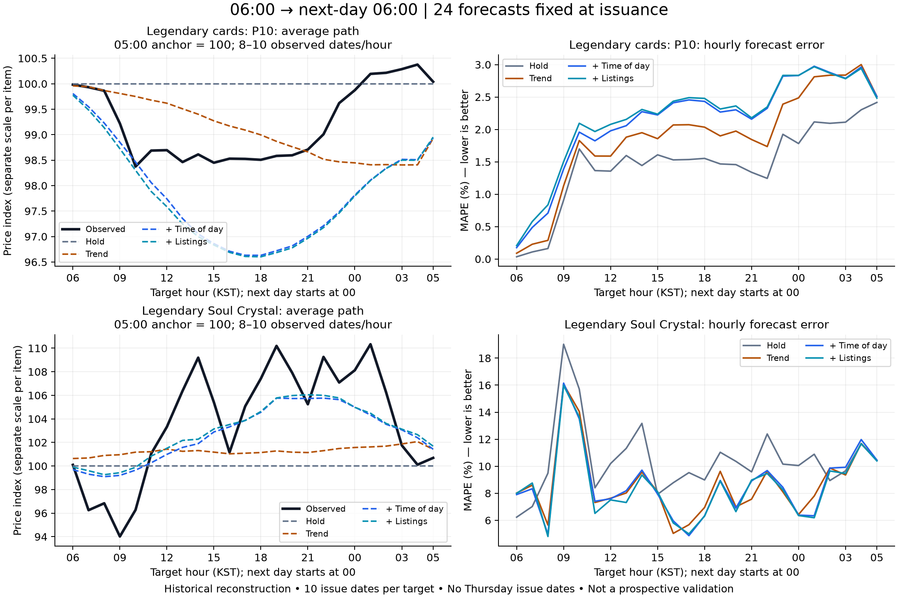

# 06→06 하루 전체 가격 경로 예측

레전더리 소울 결정은 가격 유지보다 오차가 줄었지만, 레전더리 카드 P10은 가격 유지가 더 정확했다. 평균 경로의 모양이 보인다는 것과 개별 날짜의 가격을 정확하게 맞힌다는 것은 다르다. 두 대상 모두 평가일이 10일뿐인 후향적 탐색 결과다.



## 무엇을 예측했나

매일 KST 06시에 직전 05~06시 완료 봉까지 사용해 당일 06~07시부터 다음 날 05~06시까지 24개 가격을 한꺼번에 예측했다. 하루 도중 새 자료로 수정하지 않았다. 일반 품목은 시간봉 VWAP, 카드 P10은 조사된 카드 가격의 하위 10% 지표다. 두 가격의 의미가 다르다.

[계산 규칙](full-day-protocol-2026-10-01.md)은 구현 전에 aec4d19로 커밋했다. 이미 살펴본 기간과 대상을 사용한 탐색이며, 독립적인 사전 등록·미래 발행 검증이라고 주장하지 않는다. 과거 체결 시각 기준 재구성이므로 당시의 데이터 도착 지연·백필까지 재현하지는 않는다.

## 하루 전체 경로의 오차

각 날짜에서 관측된 시간별 절대 백분율 오차를 평균한 뒤 날짜를 동일 비중으로 평균했다. 최소 18시간이 관측된 날만 포함하며 낮을수록 좋다. 아래 수치는 하루 평균 가격의 오차가 아니다.

| 대상 | 가격 유지 | 추세 | 추세+시간대 | 추세+시간대+매물 | 전날 같은 시간 가격 |
|---|---:|---:|---:|---:|---:|
| 레전더리 카드 P10 | **1.45%** | 1.87% | 2.14% | 2.19% | 2.16% |
| 레전더리 소울 결정 | 10.44% | 8.66% | 8.60% | **8.45%** | 9.57% |

- 소울 결정: 시간대 추가 효과는 추세 대비 **0.06%p**에 그쳤다. 매물까지 포함하면 가격 유지보다 약 19% 오차가 작고 10일 중 8일 우세했지만, 주된 개선을 시간대 효과만으로 설명할 수 없다.
- 카드 P10: 시간대 모델은 10일 중 4일만 가격 유지보다 나았다. 평균적인 모양을 그려도 가격 수준과 변동 폭을 틀리면 오차가 커진다.
- 전날 같은 시간 기준선은 과거 해당 시간이 없으면 제외한다. 카드의 동일 사례 가격 유지 오차는 1.44995%, 소울 결정은 10.43868%다. 다른 네 모델은 동일 사례를 사용한다.

## 실제로 보인 평균 형태

각 예측일의 05~06시 기준 가격을 100으로 맞췄다. 전체 수집 기간이 아닌 평가 가능한 10일의 평균이고 시간별 표본은 8~10일이다. 신뢰구간이나 새로운 기간 재현 검정을 통과한 법칙은 아니다.

- **카드 P10:** 10시경 98.4까지 낮아진 뒤 낮~저녁에는 약 98.5, 밤에는 회복해 01~04시에 약 100.2~100.4였다. 시간대 모델은 저점을 약 96.6으로 너무 낮게 예측했고 회복 뒤 가격도 낮게 잡았다.
- **소울 결정:** 09시경 94.0, 오후~밤에는 대체로 기준보다 높았고 다음 날 04~05시에는 약 100으로 돌아왔다. 시간대 모델은 이 형태 일부를 따라갔지만 실제 큰 변동을 놓쳤다.

평균 곡선에는 날짜별 상반된 오차가 상쇄된다. 따라서 곡선이 비슷해 보이는지와 별도로, 오른쪽 그래프에서 각 날짜에 실제로 발생한 시간별 오차를 비교한다. 방향 평가 역시 기준 05시 가격 대비 상승·보합·하락이며 인접 시간의 상승·하락이 아니다. ±0.5% 기준, 항상 상승/보합/하락 기준선과 균형 정확도를 포함한 시간별 수치는 원본 결과 JSON에 남겼다.

## 하루 평균값과 24시간 경로는 다르다

24시간 모두 관측된 **8일**만 비교하면 소울 결정의 시간별 경로 오차는 가격 유지 10.79%, 시간대 8.35%, 매물 포함 8.21%다. 같은 날의 **24개 시간 가격 산술평균** 오차는 각각 8.64%, 5.19%, 4.99%였다. 이는 수량 가중 일간 VWAP이 아니다.

전날 같은 시간 가격은 소울 결정의 하루 평균 오차가 3.16%로 더 작지만 경로 오차는 9.90%다. 하루 평균을 맞히는 방법이 어느 시간에 오르고 내리는지까지 더 잘 맞히는 것은 아니다. 카드의 전날 기준선은 완전 관측 사례가 7일이어서 다른 모델의 8일과 직접 비교하지 않는다.

## 표본과 한계

| 대상 | 달력상 원점 | 입력 결측 | 학습 부족 | 24개 예측 발행 | 실측 시간/예측 시간 | 24시간 완전 관측일 |
|---|---:|---:|---:|---:|---:|---:|
| 카드 P10 | 24 | 9 | 5 | 10일 | 238/240 | 8일 |
| 소울 결정 | 25 | 9 | 6 | 10일 | 237/240 | 8일 |

발행일은 두 대상 모두 2026-09-19~22, 09-25~30이다. **목요일 발행 사례가 없다.** 목요일 점검 전후에 같은 결과가 유지되는지 답할 수 없다. 발행 다음 날에 속한 시간도 있으므로 모든 목요일 시간 관측이 없다는 뜻은 아니다.

입력 시점의 조건으로 발행 여부를 결정했고, 미래 정답이 비어 있다고 예측을 취소하지 않았다. 미관측은 채우지 않았다. 하루 안의 24개 관측을 독립적인 24일로 세지 않으며 API 표본 상한·체결 관측 조건부·짧은 기간의 한계가 남는다.

## 재현 및 후속 판단

입력은 검증된 A+B+C 보관 자료, 기준 시각 2026-10-01 18:00 KST다. SHA-256은 `bc5bd659abf314a52f9f2661d1c2ff5b8d04cf1e5cfee145d103f56d81dfe11d`이다. 소스 manifest·날짜별 예측·시간별 방향 및 오차는 [기계 판독 결과](evidence/full-day-20261001.json)에 있다.

```sh
node scripts/full-day-forecast.ts
python scripts/plot-full-day.py
npm test
```

분석 명령은 `data/intraday-study/activity-input.json`을 사용한다. 읽기 전용 연구 워크플로에도 계산과 단위 검증을 연결했다. 이번 신규 실험은 기존 검증 입력으로 로컬 실행했으며, 새로운 원격 워크플로 실행을 완료했다고 주장하지 않는다. 그래프 생성에는 matplotlib가 필요하다.

전체 테스트 통과. 06→06 경계, 미래 가격·매물 변경에 대한 예측 불변성, 미래 결측에도 발행 유지, 전날 같은 시간 기준선을 검증했다. 공식 화면과 운영 수집 설정은 변경하지 않았다.

다음 검증은 규칙을 고정하고 새로운 날짜의 예측을 미리 저장한 뒤 평가하는 것이다. 소울 결정은 추세 대비 시간대의 추가 효과가 유지되는지, 카드는 과한 하락 예측이 새로운 기간에도 반복되는지를 확인해야 한다. 현재 결과만으로 예측선을 일반 화면에 복원하거나 매수 시간대를 확정하지 않는다.
