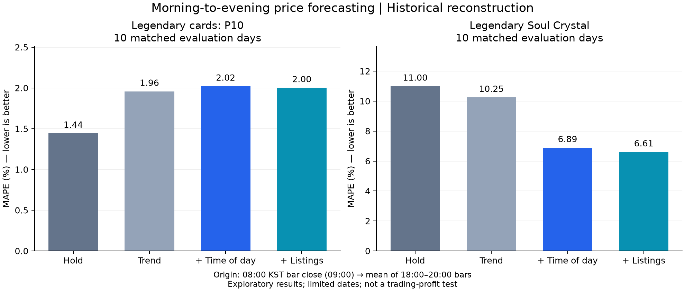

# 시간대 트렌드를 가격·방향 예측으로 연결한 공동 평가

**시간대 정보의 효과는 품목마다 달랐다.** 레전더리 카드 P10에서는 가격 오차가 개선되지 않았고, 레전더리 소울 결정에서는 개선 후보가 나타났다. 매물 정보의 추가 효과는 작고 불확실했다. 기존의 ‘거래 패턴만으로 가격 예측은 어렵다’는 설명을 모든 품목에 일반화하지 않는다.

[고정한 실험 규칙·참고 연구](intraday-joint-protocol-2026-10-01.md) · [날짜별 예측·혼동행렬·수치 기록](evidence/intraday-joint-20261001.json)

## 최근 연구를 어떻게 적용했는가

2025 Chronos-2의 외부 변수 활용과 2026 TSALM 워크숍의 통제된 외부 변수 비교를 참고해 **가격 추세 → 시간대 추가 → 매물 추가**로 분리했다. 금융 LOB 연구에서 사용하는 미래 평균 가격과 상승/보합/하락 평가를 참고하되, 던파의 관측 매물을 양방향 호가장이나 실제 주문 흐름으로 간주하지 않았다. 금융시장 모델의 성과를 던파에 가져온 것이 아니라 비교·평가 원칙을 적용한 것이다.

2026년 9월의 반사실적 주문 메시지 시장 영향 연구도 확인했지만, 우리는 해당 메시지와 실측 대응이 없어 ‘공급 증가의 인과 효과’나 실제 매매 수익은 계산하지 않았다. 대규모 사전학습 모델은 이번 실행 대상이 아니다. 이 실행은 작은 Ridge 모델의 결과이며 Chronos-2·TabPFN 등의 성능 평가가 아니다.

## 실험 조건

- 자료 상한: **2026-10-01 18:00 KST**. 앞선 검증된 A+B+C 보관 추출물을 재사용했고 DB/API/R2 재조회는 하지 않았다. 입력 SHA-256와 원본 manifest는 결과 JSON에 보존한다.
- 대상: 레전더리 P10, 소울 결정 6종, 유랑악단 6종. P10이 주 분석이며 나머지는 보조 탐색이다.
- **08시 봉 종료(09:00 KST)에 당일 18·19·20시 가격의 평균을 예측**한다. 08시 가격을 기준으로 방향을 평가한다. 일반 품목은 시간봉 VWAP의 산술평균이며 저녁 전체 수량 가중 VWAP과 다르다.
- 최근 24시간 가격 변화와 3시간 매물 변화는 원점 이전 자료만 쓴다. 시간대는 미래에도 알 수 있는 sine/cosine 변수다. 미래 실제 매물은 사용하지 않는다.
- 10·11·12시간 직접 예측을 각각 학습해 가격 평균으로 합친다. 최소 120학습쌍·학습 원점 범위 7일, 최근 최대 28일, Ridge 벌점 1 고정. 정답이 도착한 과거 쌍만 학습하고 표준화도 그 구간에서 수행한다.
- 모든 핵심 모델을 같은 날짜에서 평가한다. 목표 결측은 채점에서 제외하되 예측 생성 자체는 미래 목표 유무에 의존하지 않는다. 24시간/3시간 전 값은 정확한 시차를 요구하며 보간하지 않는다.
- 이미 살펴본 자료의 후향적 재구성이다. 날짜 순서를 지켰지만 시간 구간·모델 연구 방향은 기존 자료를 본 후 정했으므로 미사용 확증 시험이나 실제 사전 발행 평가가 아니다.

## 1. 레전더리 카드 P10: 방향 80%가 예측 개선을 뜻하지 않았다

전체 원점 날짜 24일 중 입력 부족 9일, 학습 부족 5일, 예측·채점 10일이다. 평가 기간은 **9/19~9/30 중 10일**이다. 원점 08시와 필요한 과거 시각이 정확히 있어야 하므로 기존 오전·저녁 평균 비교의 19일과 대상이 다르다.

| 모델 | MAPE | 미세한 변화도 구분한 방향 적중률 | ±0.5% 보합 적용 적중률 |
|---|---:|---:|---:|
| 마지막 가격 유지 | **1.444%** | 0% | **60%** |
| 가격 추세 | 1.958% | 60% | 30% |
| 추세 + 시간대 | 2.021% | 80% | 40% |
| 추세 + 시간대 + 매물 | 2.003% | 80% | 40% |
| 전날 같은 시간 구간 비율 | 1.656% | 80% | 60% |

미세한 변동까지 나누면 실측은 하락 8일·상승 2일이었다. 시간대 모델은 10일 모두 하락을 예측했다. **80% 적중률은 ‘항상 하락’ 기준선과 같고 상승일은 못 맞혔다.** 마지막 가격 유지는 변화 없음을 예측하므로 이 엄격한 방향 기준에서는 0%지만 가격 오차는 가장 작다.

±0.5%를 보합으로 놓으면 하락 4일·보합 6일·상승 0일이다. 시간대 모델은 보합일까지 하락 폭을 과장했다. 0.5%는 이번 평가의 고정 구분값이며 수수료·실제 이익 기준이 아니다. ±1% 보조 기준에서도 이 사례의 비율은 같다.

예를 들어 9/25에는 실측 약 101.9만 골드에 시간대 모델이 약 102.0만 골드로 잘 맞았다. 반면 9/22에는 실측 약 110.0만 골드인데 약 103.0만 골드로 낮게 예측했다. 방향과 크기를 함께 평가해야 이런 실패가 보인다.

성공 스캔 기록을 확인할 수 있는 입력·목표만 남긴 8일에서도 마지막 가격 유지 1.165%, 시간대 2.057%, 매물 추가 2.063%였다. **이번 채점 날짜에는 목요일이 한 날도 없어 목요일 제외 결과는 그대로이며, 별도의 강건성 증거가 아니다.**

시간대−추세의 오차 차이는 +0.063%p, 매물−시간대는 −0.019%p다. KST 3일 블록 탐색 재표집 구간은 각각 [−0.644,+1.113], [−0.069,+0.108]%p로 넓다. 4개 블록뿐이므로 작은 개선·악화의 확증 판정에 쓰지 않는다.

## 2. 소울 결정: 시간대 정보가 도움이 된 후보가 있다

아래는 각 품목 안에서 같은 평가 날짜를 사용한 MAPE다. 품목 간 날짜는 다를 수 있다.

| 품목 | 평가일 | 가격 유지 | 추세 | +시간대 | +매물 |
|---|---:|---:|---:|---:|---:|
| 광휘 | 7 | 16.224% | 11.657% | 11.374% | 11.355% |
| 레어 | 9 | 26.257% | 24.745% | 25.122% | 25.453% |
| **레전더리 소울 결정** | **10** | **10.995%** | **10.247%** | **6.894%** | **6.606%** |
| 태초 | 9 | 6.573% | 7.220% | 6.566% | 6.568% |
| 유니크 | 9 | 20.176% | 18.517% | 16.454% | 16.450% |
| 에픽 | 10 | 9.541% | 9.850% | 10.403% | 10.267% |

레전더리 소울 결정은 시간대를 넣었을 때 가격 유지 대비 MAPE가 약 37% 상대 감소했다(10.995→6.894). 추세만 대비 오차 차이는 −3.353%p이며 3일 블록 탐색 구간 [−4.533,−1.800]%p도 음수였다. 다만 **10일·4블록이고 여러 품목을 함께 살펴본 보조 탐색**이므로 일반화된 유의성이나 미래 성능을 주장하지 않는다.

추가 매물의 개선은 6.894→6.606으로 작고, 매물−시간대 차이 구간 [−0.550,+0.009]%p는 0을 포함한다. 핵심 후보는 매물보다 시간대 정보다.

에픽은 시간대 모델의 ±0.5% 방향 적중률이 70%였지만 가격 유지보다 MAPE가 나빴다. ‘방향을 맞히는 것’과 ‘가격을 더 정확히 맞히는 것’이 같은 예측에서도 다를 수 있다.

이 품목들의 채점 날짜에도 목요일이 없어 해당 민감도는 정보를 추가하지 못한다. 같은 시장·같은 날짜의 여러 품목을 독립적인 수십 일로 합산하지 않았다.

## 3. 유랑악단: 현재는 예측 우열을 판단하기 어렵다

칭호 상자 0일, 오라 3일, 아바타 4일, 크리쳐 9일, 세라 1일, 패키지 4일만 채점 가능했다. 크리쳐도 가격 유지 0.682%, 추세 0.636%, 시간대 0.639%, 매물 추가 0.654%로 차이가 작다. 품목군 전체에 공통 예측력이 있다고 말하지 않는다.

## 이번에 답한 것과 남은 것

- 답한 것: 시간대 패턴을 예측 입력으로 넣고 방향·가격 오차·보합·평가 가능 비율을 **같은 사례에서 함께** 검사했다. 단순 기준선과 외부 변수의 추가 효과를 분리했다.
- 얻은 후보: 레전더리 소울 결정의 시간대 효과. 레전더리 카드 P10과 혼동하지 않는다.
- 확인 못 한 것: 수요·공급의 인과관계, 매물의 일반적인 예측 가치, 실제 거래 수익, 목요일 성능, 새 기간에서도 유지될 성능.
- 다음 검증: 같은 규칙을 유지한 신규 날짜의 사전 발행 평가. 새 모델을 고를 때는 이번 자료가 개발 자료였음을 유지한다. P10에서 하락 폭 과장이 나타난 만큼 최근 변화에 대한 적응·보수적 보정은 다음 별도 실험 후보이며 이번 결과를 보고 재조정하지 않았다.



## 재현

```bash
node scripts/test-intraday-joint-forecast.ts
node scripts/intraday-joint-forecast.ts
python scripts/plot-intraday-joint.py # matplotlib 필요, 그림 생성만 담당
```

첫 두 명령은 기존 `data/intraday-study/activity-input.json`을 사용한다. `joint-forecast-results.json`에는 날짜별 예측·실측·학습 수·제외 이유·혼동행렬을 남긴다. 수동 연구 workflow에도 계산을 추가했다. 사이트 배포·운영 예측·수집 주기는 변경하지 않았다.
