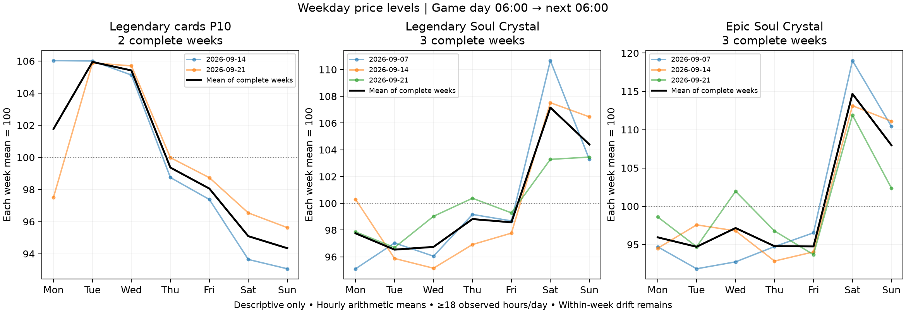

# 시간대 없이 요일만 본 가격 추세

요일×시간대 예측과 별도로, 06시~다음 날 06시를 하루로 집계했다. **카드 P10의 목요일 하락, 레전더리·에픽 소울 결정의 토요일 상승이 반복 관측 후보**다. 예측 성능이나 통계적 유의성을 검증한 결과는 아니다.

## 계산 기준

- 자료 기준은 2026-10-01 18:00 KST, 검증된 보관본의 시간별 입력이다. 10월 2일 신규 자료는 포함하지 않았다.
- 시간별 가격의 산술평균으로 하루 가격을 계산한다. 일반 품목의 시간별 값은 체결 VWAP이지만, 시간 간 수량 가중을 하지 않으므로 하루 전체 거래 VWAP과 다르다. 카드의 값은 업그레이드 단계별 최저호가, P10은 저가 지표다.
- 하루가 완전히 끝나고 24시간 중 18시간 이상 관측된 경우만 사용한다. 결측은 보간하지 않는다. 기존 하루 안 4구간 분석처럼 오전 최소 4시간을 별도로 요구하지 않아서 일부 목요일이 다시 포함된다.
- 가격 수준: 월~일 7일이 모두 유효한 주만 사용하고 해당 주 평균을 100으로 맞춘다. 주별 기준 가격 차이는 줄이지만 **주중에 계속 하락/상승하는 추세는 제거하지 않는다.** 요일의 인과효과가 아니다.
- 전날 대비 변화: 정확히 직전 날짜가 유효할 때만 계산한다. 완전한 주에 속하지 않은 날짜 쌍도 포함하므로 수준 프로파일과 표본이 다를 수 있다.
- 같은 시각의 관측이 다른 구성을 갖는 문제를 확인하기 위해 두 날 공통 관측 시간이 18개 이상인 쌍도 별도로 계산한다. 단순 하루평균과 공통시간 비교를 혼동하지 않는다.
- 그룹은 매주 구성 아이템을 바꾸지 않고 동일 구성·공통 완전 주에서만 동일 비중 평균한다.

## 주요 관측

| 비교 | 09-10/12 | 09-17/19 | 09-24/26 |
|---|---:|---:|---:|
| 카드 P10: 목요일/수요일 | −1.94% | −6.07% | −5.40% |
| 레전더리 소울: 토요일/금요일 | +12.14% | +9.97% | +4.03% |
| 에픽 소울: 토요일/금요일 | +23.29% | +20.30% | +19.44% |

카드 P10 목요일 3회 모두 하루 관측시간 평균은 하락했다. 하지만 앞의 두 목요일은 전날과 공통 관측 시간이 17개여서 18시간 공통 기준에서는 제외된다. 마지막 09-24만 20시간 공통 비교가 가능하며 −5.63%였다. **결측 민감도를 통과한 목요일 3회 반복이라고 표현할 수 없다.** 소울 두 종의 토요일 비교는 모두 양일 24시간 관측이 있어 동일시간 비교에서도 위 변화율이 유지된다.

카드 P10의 완전 주는 09-14·09-21 시작 두 주다. 평균 지수는 화 105.94, 수 105.41, 목 99.37, 금 98.06, 토 95.09, 일 94.35였다. 이 기간 전체 하락 추세가 주후반 저가 모양을 만들 수 있어 “일요일이 원래 싸다”로 확정하지 않는다.

소울 결정 6종 공통 두 주의 평균에서는 토요일이 높았지만, 주별 토요일 지수는 96.15와 131.92로 달랐다. 그룹 평균의 토요일 급등을 매주 모든 결정에 공통인 패턴으로 해석하면 안 된다. 레전더리·에픽의 개별 반복과 구분한다.

유랑악단 6종 공통 완전 주는 0개다. 칭호의 관측 부족 때문에 전체 그룹 요일 곡선을 만들지 않았고 개별 품목별 결과만 남겼다. 카드 68단계 시계열 중 완전 주 2개 이상은 47개다.

## 전체 품목의 요일 가격 수준

각 주 평균=100. 1주짜리는 반복 비교가 불가능하다. 아래 표의 최저·최고 요일을 새로운 기간에서 검증된 매수·매도 시점으로 사용하지 않는다.

| 품목·기준 | 완전 주 | 월 | 화 | 수 | 목 | 금 | 토 | 일 |
|---|---:|---:|---:|---:|---:|---:|---:|---:|
| 유니크 소울 결정 · 체결 시간봉 VWAP | 3 | 98.40 | 103.04 | 103.08 | 97.69 | 95.17 | 116.21 | 86.41 |
| 숲속의 유랑악단 칭호 상자 · 체결 시간봉 VWAP | 0 | — | — | — | — | — | — | — |
| 숲속의 유랑악단 오라 상자 · 체결 시간봉 VWAP | 2 | 100.53 | 100.77 | 100.81 | 100.38 | 99.10 | 98.61 | 99.80 |
| 숲속의 유랑악단 아바타 풀세트 상자 · 체결 시간봉 VWAP | 2 | 102.08 | 101.59 | 100.96 | 100.58 | 100.16 | 98.03 | 96.60 |
| 숲속의 유랑악단 크리쳐 상자 · 체결 시간봉 VWAP | 3 | 99.97 | 100.58 | 99.67 | 99.84 | 99.75 | 99.78 | 100.41 |
| 숲속의 유랑악단 세라 상자 · 체결 시간봉 VWAP | 1 | 100.61 | 102.15 | 101.50 | 100.62 | 97.93 | 97.98 | 99.22 |
| 레어 소울 결정 · 체결 시간봉 VWAP | 3 | 89.40 | 85.29 | 129.68 | 76.71 | 87.95 | 118.01 | 112.96 |
| 태초 소울 결정 · 체결 시간봉 VWAP | 3 | 103.86 | 102.71 | 103.12 | 94.58 | 97.46 | 99.35 | 98.92 |
| 숲속의 유랑악단 패키지 · 체결 시간봉 VWAP | 1 | 100.93 | 101.98 | 101.10 | 100.42 | 98.55 | 97.98 | 99.02 |
| 광휘의 소울 결정 · 체결 시간봉 VWAP | 2 | 98.72 | 99.61 | 100.09 | 103.71 | 105.78 | 100.67 | 91.42 |
| 레전더리 소울 결정 · 체결 시간봉 VWAP | 3 | 97.76 | 96.54 | 96.74 | 98.82 | 98.58 | 107.16 | 104.40 |
| 에픽 소울 결정 · 체결 시간봉 VWAP | 3 | 95.94 | 94.71 | 97.16 | 94.78 | 94.75 | 114.68 | 107.97 |
| 레전더리 카드 저가 지표 · P10 | 2 | 101.77 | 105.94 | 105.41 | 99.37 | 98.06 | 95.09 | 94.35 |
| 종언을 고하는 본능 카드 · 미업글 최저호가 | 2 | 90.93 | 90.11 | 94.39 | 106.57 | 109.58 | 112.60 | 95.83 |
| 멸절의 폭룡왕 바칼 카드 · 미업글 최저호가 | 2 | 89.25 | 84.12 | 97.56 | 107.75 | 116.46 | 103.01 | 101.85 |
| 조율의 감시자 오르테르 카드 · 미업글 최저호가 | 2 | 101.26 | 100.72 | 99.51 | 99.26 | 98.97 | 100.05 | 100.24 |
| 비명을 머금은 분노 카드 · 미업글 최저호가 | 2 | 95.54 | 92.36 | 91.63 | 97.07 | 117.48 | 106.31 | 99.62 |
| 제6사도 디레지에 카드 · 미업글 최저호가 | 2 | 98.76 | 97.22 | 98.19 | 98.26 | 110.28 | 100.28 | 97.02 |
| 진실을 꿰뚫어 보는 자 카드 · 미업글 최저호가 | 0 | — | — | — | — | — | — | — |
| 뒤쫓는 자 제논 카드 · 미업글 최저호가 | 1 | 308.47 | 78.27 | 68.29 | 62.80 | 60.99 | 59.03 | 62.15 |
| 기억과 안개의 신, 무 카드 · 미업글 최저호가 | 2 | 79.05 | 74.44 | 76.41 | 106.81 | 120.43 | 129.23 | 113.64 |
| 무너진 성자 미카엘라 카드 · 미업글 최저호가 | 2 | 99.80 | 101.38 | 101.35 | 97.66 | 99.22 | 102.14 | 98.44 |
| 3대대 부관 철편자 카르케오 카드 · 미업글 최저호가 | 2 | 87.30 | 74.79 | 103.93 | 118.30 | 113.33 | 106.09 | 96.26 |
| 인공신 2호 아니마 카드 · 미업글 최저호가 | 2 | 97.91 | 99.99 | 94.97 | 93.47 | 111.56 | 105.98 | 96.12 |
| 재앙을 일으키는 육신 카드 · 미업글 최저호가 | 2 | 102.96 | 99.19 | 102.07 | 101.62 | 100.15 | 98.53 | 95.48 |
| 최후의 테아나 카드 · 미업글 최저호가 | 2 | 101.67 | 95.01 | 100.78 | 100.78 | 103.59 | 104.99 | 93.18 |
| 자유로운 이카 카드 · 미업글 최저호가 | 2 | 102.95 | 96.46 | 99.62 | 102.30 | 95.50 | 105.11 | 98.05 |
| 신실한 소코르스 카드 · 미업글 최저호가 | 0 | — | — | — | — | — | — | — |
| 치유의 손길 라파엘 카드 · 미업글 최저호가 | 2 | 104.96 | 102.44 | 98.32 | 93.09 | 101.63 | 104.34 | 95.23 |
| 가려진 정의 미카엘 카드 · 미업글 최저호가 | 2 | 102.02 | 100.38 | 99.51 | 100.76 | 104.45 | 101.40 | 91.48 |
| 폭음 크래시머 카드 · 미업글 최저호가 | 2 | 96.35 | 93.56 | 93.73 | 91.92 | 111.30 | 114.52 | 98.61 |
| 더 파이퍼 카드 · 미업글 최저호가 | 2 | 76.61 | 77.64 | 80.08 | 147.69 | 116.66 | 111.53 | 89.80 |
| 연구소장 엘디르 카드 · 미업글 최저호가 | 2 | 90.49 | 91.50 | 91.46 | 107.19 | 120.17 | 105.11 | 94.10 |
| 마법 같은 행운 엘리브 카드 · 미업글 최저호가 | 2 | 104.83 | 101.74 | 101.25 | 100.14 | 98.77 | 95.77 | 97.50 |
| 거짓의 베리디쿠스 카드 · 미업글 최저호가 | 2 | 102.34 | 101.23 | 102.63 | 96.26 | 100.28 | 98.99 | 98.27 |
| 인공신 3호 나벨 카드 · 미업글 최저호가 | 2 | 94.94 | 91.10 | 90.71 | 97.75 | 123.13 | 103.67 | 98.71 |
| 해방된 비올렌티아 카드 · 미업글 최저호가 | 2 | 103.31 | 99.09 | 100.42 | 86.74 | 94.55 | 114.05 | 101.85 |
| 일각수 크라켄 카드 · 미업글 최저호가 | 2 | 106.33 | 98.25 | 97.58 | 105.93 | 101.92 | 97.99 | 91.99 |
| 안개신의 무의식 카드 · 미업글 최저호가 | 2 | 101.45 | 108.60 | 105.32 | 98.68 | 97.32 | 94.94 | 93.70 |
| 영혼의 안내자 사리엘 카드 · 미업글 최저호가 | 2 | 101.48 | 105.66 | 107.15 | 99.56 | 98.16 | 94.10 | 93.89 |
| 마법을 품은 배니부 카드 · 미업글 최저호가 | 2 | 103.35 | 95.67 | 91.04 | 91.49 | 96.07 | 111.64 | 110.75 |
| 구속의 공작 유리스 카드 · 미업글 최저호가 | 2 | 99.69 | 99.19 | 101.38 | 99.52 | 101.71 | 101.47 | 97.03 |
| 진리의 불꽃 우리엘 카드 · 미업글 최저호가 | 2 | 103.15 | 94.59 | 93.82 | 96.22 | 111.41 | 107.17 | 93.65 |
| 더러운 피를 흘리는 자 카드 · 미업글 최저호가 | 2 | 98.48 | 93.78 | 101.61 | 104.64 | 101.47 | 97.06 | 102.96 |
| 타락한 사도 미카엘라 카드 · 미업글 최저호가 | 1 | 107.71 | 105.66 | 102.10 | 98.38 | 95.62 | 98.23 | 92.31 |
| 종말의 칼날 로페즈 카드 · 미업글 최저호가 | 2 | 88.01 | 85.45 | 105.07 | 111.12 | 107.47 | 101.48 | 101.40 |
| 광포의 마흐나발 카드 · 미업글 최저호가 | 2 | 101.68 | 100.85 | 97.90 | 96.46 | 107.00 | 104.37 | 91.74 |
| 연구소장 엘디르 카드 · 풀업 최저호가 | 2 | 96.78 | 97.24 | 99.74 | 103.06 | 111.35 | 102.06 | 89.77 |
| 폭음 크래시머 카드 · 풀업 최저호가 | 2 | 97.13 | 98.76 | 97.51 | 104.84 | 105.88 | 104.03 | 91.85 |
| 일각수 크라켄 카드 · 풀업 최저호가 | 1 | 98.71 | 103.17 | 101.52 | 105.09 | 102.41 | 98.31 | 90.79 |
| 해방된 비올렌티아 카드 · 풀업 최저호가 | 1 | 103.80 | 107.83 | 113.51 | 90.65 | 90.14 | 99.18 | 94.88 |
| 마법을 품은 배니부 카드 · 풀업 최저호가 | 2 | 101.41 | 102.91 | 108.48 | 96.49 | 95.03 | 97.74 | 97.94 |
| 거짓의 베리디쿠스 카드 · 풀업 최저호가 | 2 | 104.89 | 103.78 | 103.24 | 97.09 | 96.63 | 97.78 | 96.59 |
| 마법 같은 행운 엘리브 카드 · 풀업 최저호가 | 2 | 104.34 | 102.97 | 101.71 | 98.80 | 98.21 | 96.81 | 97.15 |
| 안개신의 무의식 카드 · 풀업 최저호가 | 2 | 98.41 | 110.26 | 110.15 | 98.77 | 97.94 | 93.29 | 91.18 |
| 더 파이퍼 카드 · 풀업 최저호가 | 1 | 96.98 | 97.62 | 96.97 | 107.77 | 115.05 | 100.90 | 84.72 |
| 영혼의 안내자 사리엘 카드 · 풀업 최저호가 | 2 | 103.55 | 108.89 | 107.20 | 99.91 | 97.92 | 91.94 | 90.59 |
| 인공신 3호 나벨 카드 · 풀업 최저호가 | 2 | 97.05 | 96.73 | 96.64 | 108.81 | 110.86 | 98.22 | 91.69 |
| 기억과 안개의 신, 무 카드 · 풀업 최저호가 | 2 | 94.53 | 106.72 | 113.91 | 100.55 | 97.80 | 88.24 | 98.25 |
| 멸절의 폭룡왕 바칼 카드 · 풀업 최저호가 | 2 | 95.71 | 85.80 | 87.07 | 99.91 | 115.10 | 122.61 | 93.80 |
| 무너진 성자 미카엘라 카드 · 풀업 최저호가 | 1 | 109.52 | 103.79 | 99.58 | 97.76 | 96.18 | 98.76 | 94.42 |
| 제6사도 디레지에 카드 · 풀업 최저호가 | 2 | 104.59 | 99.52 | 100.73 | 99.88 | 102.49 | 96.91 | 95.88 |
| 종말의 칼날 로페즈 카드 · 풀업 최저호가 | 1 | 103.52 | 106.34 | 106.39 | 103.84 | 96.49 | 90.59 | 92.84 |
| 종언을 고하는 본능 카드 · 풀업 최저호가 | 2 | 95.54 | 96.28 | 97.83 | 107.62 | 109.85 | 104.31 | 88.57 |
| 진리의 불꽃 우리엘 카드 · 풀업 최저호가 | 2 | 103.45 | 93.09 | 89.91 | 98.04 | 111.27 | 108.50 | 95.73 |
| 진실을 꿰뚫어 보는 자 카드 · 풀업 최저호가 | 0 | — | — | — | — | — | — | — |
| 비명을 머금은 분노 카드 · 풀업 최저호가 | 2 | 96.86 | 94.32 | 96.89 | 105.31 | 110.35 | 101.96 | 94.32 |
| 조율의 감시자 오르테르 카드 · 풀업 최저호가 | 2 | 100.79 | 98.61 | 96.88 | 103.02 | 97.24 | 104.47 | 98.99 |
| 타락한 사도 미카엘라 카드 · 풀업 최저호가 | 0 | — | — | — | — | — | — | — |
| 더러운 피를 흘리는 자 카드 · 풀업 최저호가 | 1 | 105.16 | 100.54 | 98.42 | 94.91 | 95.21 | 97.62 | 108.15 |
| 뒤쫓는 자 제논 카드 · 풀업 최저호가 | 1 | 117.49 | 113.18 | 112.66 | 108.09 | 103.15 | 86.89 | 58.55 |
| 3대대 부관 철편자 카르케오 카드 · 풀업 최저호가 | 0 | — | — | — | — | — | — | — |
| 인공신 2호 아니마 카드 · 풀업 최저호가 | 1 | 95.62 | 97.40 | 96.89 | 99.97 | 115.80 | 104.30 | 90.03 |
| 재앙을 일으키는 육신 카드 · 풀업 최저호가 | 0 | — | — | — | — | — | — | — |
| 최후의 테아나 카드 · 풀업 최저호가 | 2 | 104.01 | 102.57 | 102.05 | 102.59 | 101.75 | 96.14 | 90.88 |
| 자유로운 이카 카드 · 풀업 최저호가 | 1 | 105.98 | 108.89 | 104.83 | 97.60 | 91.70 | 92.60 | 98.40 |
| 신실한 소코르스 카드 · 풀업 최저호가 | 0 | — | — | — | — | — | — | — |
| 치유의 손길 라파엘 카드 · 풀업 최저호가 | 1 | 104.66 | 103.60 | 102.04 | 95.08 | 96.41 | 102.79 | 95.43 |
| 가려진 정의 미카엘 카드 · 풀업 최저호가 | 0 | — | — | — | — | — | — | — |
| 광포의 마흐나발 카드 · 풀업 최저호가 | 1 | 110.38 | 108.14 | 101.73 | 96.63 | 91.05 | 96.58 | 95.49 |
| 구속의 공작 유리스 카드 · 풀업 최저호가 | 2 | 102.43 | 99.75 | 101.64 | 100.58 | 98.37 | 99.09 | 98.13 |

## 해석과 다음 단계

시간대를 나누지 않아도 요일별 가격 흐름을 관측할 수 있다. 이번에는 레전더리·에픽 소울의 토요일 상승이 3회 반복됐다는 점이 후속 후보이고, 카드 P10 목요일 하락은 결측 통제를 보강해야 하는 후보다. 출시·이벤트·전체 시장 추세와 분리한 효과 또는 미래 예측력이 확정된 것은 아니다.

추후에는 이 후보와 계산 기준을 고정하고 새 주의 하루 평균 가격 방향을 사전에 발행해 검증해야 한다. 3회 모두 같은 방향이었다고 다음 주 확률을 100%로 표시하지 않는다.

## 재현

`python scripts/test-weekday-only.py`, `python scripts/weekday-only-study.py`, `python scripts/render-weekday-only.py`. 입력은 `data/activity-research-verified/hourly.json`·`report.json`과 품목 메타데이터 `data/intraday-study/activity-input.json`이다. 06시 경계·미완료일·결측·완전 주·정확히 하루 전 비교를 합성 자료로 검증했다.

[전체 날짜·요일 프로파일·주별 값·전날 변화·공통시간 변화 JSON](evidence/weekday-only-20261002.json)에 입력 해시를 보존했다. `inputHashes`는 읽은 입력 세 파일(`hourly.json`·`report.json`·`activity-input.json`)의 SHA-256이고 `inputHash`는 이 셋을 합친 식별자다. 운영 수집과 사이트는 변경하지 않았다.
